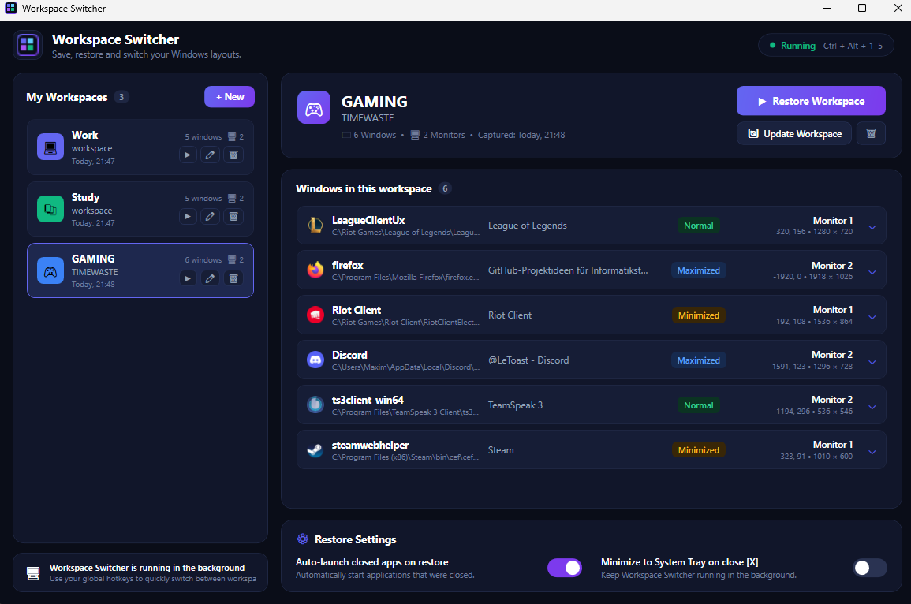
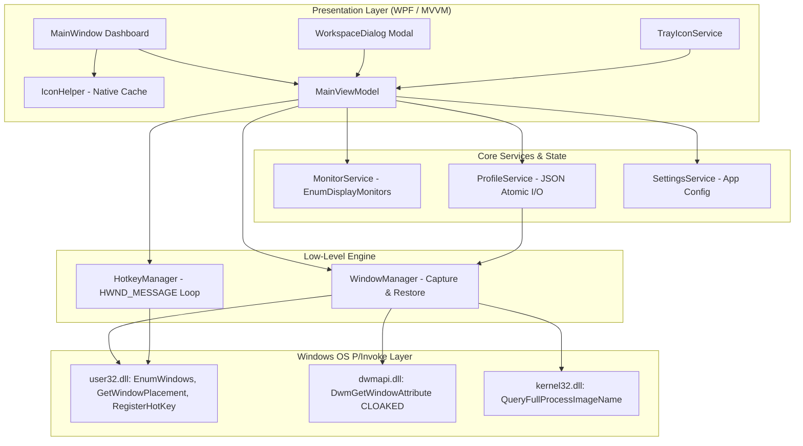

# 🪟 Workspace Switcher

<div align="center">


**A high-performance, native Windows utility to snapshot, customize, and instantly restore multi-monitor window layouts and application workspaces via global hotkeys, standalone executable, and system tray.**

[Features](#-key-features) • [Architecture](#-architecture) • [How It Works Under The Hood](#-how-it-works-under-the-hood) • [Quick Start](#-quick-start) • [Troubleshooting](#-troubleshooting--common-issues) • [Project Structure](#-project-structure)

<br />
<br />



<br />

<sub><i>Modern Cyberpunk / Indigo Glassmorphism UI with multi-monitor coordinates, native executable process icon extraction, modal workspace creator, and real-time window inspection.</i></sub>

</div>

---

## 💡 The Problem & Solution

### The Problem
When switching between multi-monitor setups, docking stations, unplugging external displays, or alternating between daily tasks (*Coding*, *Gaming*, *Meeting/Writing*), Windows frequently scrambles application windows. Manually dragging, resizing, and positioning 5 to 15 apps across multiple monitors repeatedly wastes valuable productivity time.

### The Solution
**Workspace Switcher** captures the exact pixel-level geometry, window placement states (`Normal`, `Maximized`, `Minimized`), process metadata, and monitor coordinates of all active applications into human-readable JSON profiles. With a single global hotkey (e.g. `Ctrl+Alt+1`) or from the System Tray, all windows smoothly snap back to their exact designated coordinates and monitors.

---

## ✨ Key Features

* 📸 **Intelligent Multi-Monitor Snapshots:** Automatically discovers all user-facing application windows across all connected displays while filtering out invisible system services, desktop shells, and suspended UWP apps.
* ⚡ **Pixel-Perfect Restoration:** Restores exact window coordinates and states (`Maximized`, `Normal`, `Minimized`) across single- and multi-monitor setups without coordinate distortion or window borders glitches.
* 🎨 **Dedicated Workspace Creation & Edit Modal:** Click **`+ New`** or the **`✏️` Edit** button on any workspace to open a centered Dark Glassmorphism dialog where you can rename profiles, edit descriptions, and choose from a 16-icon glyph palette (`💻`, `🎮`, `📚`, `💼`, `🎨`, `🚀`, `🌐`, `⚙️`, `🎬`, `🎧`, `⚡`, `🔥`, `🏆`, `📱`, `💡`, `☕`).
* 🎛️ **Interactive Window Customization Drawer:** Click on any window card to expand its detailed inspector:
  * **Target Window State:** Set to `Normal`, `Maximized`, or `Minimized`.
  * **Target Monitor:** Shift the window to `Monitor 1`, `Monitor 2`, or `Monitor 3` with automatic pixel offset recalculation.
  * **Pixel Coordinates:** Fine-tune `X`, `Y`, `Width`, and `Height` parameters.
  * **Exclusion / Deletion:** Remove specific windows from the workspace with instant reactive auto-save.
* 🖼️ **Native High-Res Executable Icon Extraction:** Automatically extracts and renders the authentic high-resolution application icon from each process's `.exe` on disk with concurrent memory caching.
* ⌨️ **Standalone Global Hotkey Dispatcher:** Dedicated Win32 message-only thread (`HWND_MESSAGE`) enables zero-latency global shortcuts (`Ctrl+Alt+1..5`) without blocking or relying on the GUI thread.
* 🪟 **System Tray Quick-Switch & 1-Click `.exe` Launch:** Runs cleanly in the background with a system tray icon, auto-minimizaton, and single-file portable release distribution (`publish/WorkspaceSwitcher.UI.exe`).
* 🚀 **Auto-Launch Missing Apps:** Optionally launches closed applications using their saved disk executable paths during layout restoration.
* 🛡️ **Zero-Corruption Persistence:** Profiles are stored as human-readable JSON files in `%APPDATA%\WorkspaceSwitcher\Profiles` with atomic file replace mechanics.

---

## 🏛️ Architecture

The application is structured into modular layers, separating low-level Win32 P/Invoke APIs, business logic, persistence services, and the presentation layer.



---

## 🔬 How It Works Under The Hood

### 1. Robust Window Enumeration & Ghost Filtering
Enumerating windows naively using `IsWindowVisible` yields dozens of invisible background windows, Cortana/Search hosts, desktop handles, and suspended UWP processes. `WindowManager` implements a strict 5-stage validation pipeline:

```csharp
public static bool IsValidAppWindow(IntPtr hWnd, IntPtr shellHwnd, int currentProcessId)
{
    if (hWnd == IntPtr.Zero || hWnd == shellHwnd) return false;
    if (!NativeMethods.IsWindowVisible(hWnd)) return false;

    // 1. Exclude our own WorkspaceSwitcher application windows
    NativeMethods.GetWindowThreadProcessId(hWnd, out int processId);
    if (processId == currentProcessId) return false;

    // 2. Filter out cloaked windows (suspended UWP apps & virtual desktop ghosts)
    int cloakedVal = 0;
    int hr = NativeMethods.DwmGetWindowAttribute(hWnd, DWMWA_CLOAKED, out cloakedVal, sizeof(int));
    if (hr == 0 && cloakedVal != 0) return false;

    // 3. Reject empty title windows (background helpers)
    if (NativeMethods.GetWindowTextLength(hWnd) == 0) return false;

    // 4. Reject ToolWindows unless explicitly AppWindow
    long exStyle = NativeMethods.GetWindowLongPtr(hWnd, GWL_EXSTYLE).ToInt64();
    if ((exStyle & WS_EX_TOOLWINDOW) != 0 && (exStyle & WS_EX_APPWINDOW) == 0) return false;

    // 5. Blacklist Shell and System Class Names (Progman, WorkerW, Shell_TrayWnd)
    var classSb = new StringBuilder(256);
    NativeMethods.GetClassName(hWnd, classSb, classSb.Capacity);
    if (IgnoredClasses.Contains(classSb.ToString())) return false;

    return true;
}
```

* **DWM Cloaking (`DWMWA_CLOAKED`):** Windows 10/11 marks UWP apps and windows residing on inactive Virtual Desktops with cloaking flags (`DWM_CLOAKED_APP`, `DWM_CLOAKED_SHELL`). Checking this attribute prevents capturing ghost windows.
* **Window Style Masks:** Checking `GWL_EXSTYLE` filters out tooltips, context menus, and notification popups.

---

### 2. Geometry Restoration: `WINDOWPLACEMENT` vs. `GetWindowRect`
A common pitfall in window managers is using `GetWindowRect` and `SetWindowPos` for maximized windows. When a window is maximized, `GetWindowRect` returns the physical monitor bounding box. If saved and later restored to a "Normal" state, the window remains permanently stuck at full-screen dimensions.

**Solution:** Workspace Switcher captures and restores the native `WINDOWPLACEMENT` structure:
```csharp
[StructLayout(LayoutKind.Sequential)]
public struct WINDOWPLACEMENT
{
    public int length;
    public int flags;
    public int showCmd;          // SW_SHOWNORMAL, SW_SHOWMAXIMIZED, SW_SHOWMINIMIZED
    public POINT ptMinPosition;
    public POINT ptMaxPosition;
    public RECT rcNormalPosition; // Exact coordinates when not maximized
}
```
* `rcNormalPosition` preserves the true un-maximized rectangle.
* `SetWindowPlacement` restores both the coordinates and the window state seamlessly without coordinate recalculation glitches.

---

### 3. Dedicated `HWND_MESSAGE` Global Hotkey Loop
Registering global hotkeys via `RegisterHotKey` requires a Win32 message loop on the calling thread. Coupling this to a WPF window handle (`HwndSource`) can cause lifecycle conflicts or lockups when the window is hidden or minimized to the System Tray.

**Solution:** `HotkeyManager` spawns a dedicated STA background thread that creates a pure Win32 **Message-Only Window** (`HWND_MESSAGE`):
* The message loop runs independently with `GetMessage` / `TranslateMessage` / `DispatchMessage`.
* Hotkey registration requests are posted across threads via `WM_USER`.
* Incoming `WM_HOTKEY` messages are dispatched asynchronously via the `ThreadPool` so subscriber callbacks cannot block the Win32 message pump.

---

### 4. Bypassing Process Elevation & 32/64-Bit Boundaries
Calling `Process.MainModule.FileName` in .NET throws a `Win32Exception: Access is denied` when inspecting elevated processes or 32-bit processes from a 64-bit host.

**Solution:** `WindowManager` uses `OpenProcess` with `PROCESS_QUERY_LIMITED_INFORMATION` combined with `QueryFullProcessImageName`:
```csharp
IntPtr hProcess = NativeMethods.OpenProcess(PROCESS_QUERY_LIMITED_INFORMATION, false, processId);
if (hProcess != IntPtr.Zero)
{
    try
    {
        var sb = new StringBuilder(1024);
        int size = sb.Capacity;
        if (NativeMethods.QueryFullProcessImageName(hProcess, 0, sb, ref size))
            return sb.ToString();
    }
    finally { NativeMethods.CloseHandle(hProcess); }
}
```

---

### 5. Zero-Corruption Atomic JSON Persistence
To prevent corrupt profile files in case of sudden power interruptions or crashes during a write operation, `ProfileService` implements an **Atomic Write Pattern**:
1. Serialize JSON to a temporary file (`profile.json.tmp`).
2. Atomically replace the destination file using `File.Replace` (or `File.Move`).
3. Store readable string enums (`WindowState: "Maximized"`) via `JsonStringEnumConverter`.

---

## 📁 JSON Profile Schema

Profiles are stored in `%APPDATA%\WorkspaceSwitcher\Profiles\<ProfileName>.json`:

```json
{
  "name": "Coding",
  "description": "Dual monitor development setup",
  "iconGlyph": "💻",
  "createdAt": "2026-08-31T17:34:00Z",
  "lastModifiedAt": "2026-08-31T21:40:00Z",
  "displayCount": 2,
  "windows": [
    {
      "processName": "Code",
      "executablePath": "C:\\Users\\User\\AppData\\Local\\Programs\\Microsoft VS Code\\Code.exe",
      "windowTitle": "WorkspaceSwitcher - Visual Studio Code",
      "className": "Chrome_WidgetWin_1",
      "placement": {
        "flags": 0,
        "state": "Maximized",
        "minPosition": { "x": -1, "y": -1 },
        "maxPosition": { "x": -1, "y": -1 },
        "normalPosition": { "left": 100, "top": 100, "right": 1820, "bottom": 1000 }
      },
      "bounds": { "left": 0, "top": 0, "right": 1920, "bottom": 1080 }
    }
  ]
}
```

---

## 🚀 Quick Start

### 1. Prerequisites
* **Windows 10 / 11** (x64 / ARM64)
* **.NET 8.0 SDK** (if building from source).

> **💡 Quick Install via Windows Package Manager (winget):**
> ```powershell
> winget install Microsoft.DotNet.SDK.8
> ```
> *(Or manually download from [dotnet.microsoft.com/download](https://dotnet.microsoft.com/download/dotnet/8.0)).*

---

### 2. Launch Standalone Executable (Fastest)
A ready-to-run portable single-file executable is generated in `./publish`:
```powershell
./publish/WorkspaceSwitcher.UI.exe
```
*(Or double-click the **Workspace Switcher** shortcut on your Desktop).*

---

### 3. Build & Run From Source

1. **Clone the repository:**
   ```powershell
   git clone https://github.com/yMaxM15/workspace-switcher.git
   cd workspace-switcher
   ```

2. **Build the Solution:**
   ```powershell
   dotnet build WorkspaceSwitcher.sln -c Release
   ```

3. **Launch the WPF Dashboard & Tray Application:**
   ```powershell
   dotnet run --project src/WorkspaceSwitcher.UI
   ```

4. **(Optional) Run the Headless CLI Diagnostic Tool:**
   ```powershell
   dotnet run --project src/WorkspaceSwitcher.Cli
   ```

---

## 📂 Project Structure

```text
workspace-switcher/
├── .gitignore
├── README.md
├── WorkspaceSwitcher.sln
├── publish/                                 # Standalone single-file Release executable
│   └── WorkspaceSwitcher.UI.exe
└── src/
    ├── WorkspaceSwitcher.Core/              # Core Engine Class Library (.NET 8)
    │   ├── Hotkeys/
    │   │   ├── HotkeyManager.cs             # Win32 HWND_MESSAGE Global Hotkey Loop
    │   │   ├── HotKeyModel.cs               # HotKeyBinding & EventArgs
    │   │   └── KeyModifiers.cs              # Modifiers Enum (Ctrl, Alt, Shift, Win)
    │   ├── Models/
    │   │   ├── AppSettings.cs               # Application preferences model
    │   │   ├── WindowInfo.cs                # Window metadata & process paths
    │   │   ├── WindowPlacementInfo.cs       # Geometry & state DTOs
    │   │   └── WorkspaceProfile.cs          # Workspace profile container with icon glyph
    │   ├── Native/
    │   │   └── NativeMethods.cs             # 64-bit safe Win32 & DWM P/Invoke declarations
    │   ├── Services/
    │   │   ├── IProfileService.cs           # Profile management interface
    │   │   ├── MonitorService.cs            # Multi-display detection & bounds service
    │   │   ├── ProfileService.cs            # Atomic JSON read/write persistence
    │   │   └── SettingsService.cs           # Application configuration service
    │   └── WindowManager.cs                 # Snapshot filtering, matching & repositioning engine
    │
    ├── WorkspaceSwitcher.UI/                # Modern Cyberpunk WPF Application (.NET 8)
    │   ├── App.xaml / App.xaml.cs           # App lifecycle & glassmorphism theme resources
    │   ├── MainWindow.xaml / .cs            # 2-column dark dashboard & window inspector
    │   ├── app.ico                          # Multi-resolution application icon (16-256px)
    │   ├── Views/
    │   │   └── WorkspaceDialog.xaml / .cs   # Modal dialog for creating and editing profiles
    │   ├── Services/
    │   │   ├── IconHelper.cs                # Native high-res .exe icon extractor & cache
    │   │   └── TrayIconService.cs           # System Tray Icon & dynamic context menu
    │   └── ViewModels/
    │       ├── MainViewModel.cs             # Primary MVVM ViewModel
    │       ├── ProfileItemViewModel.cs      # Workspace Card & Icon ViewModel
    │       ├── WindowItemViewModel.cs       # Per-Window Inspector ViewModel
    │       └── RelayCommand.cs              # Generic ICommand implementation
    │
    └── WorkspaceSwitcher.Cli/               # Headless CLI & Test Runner
        └── Program.cs                       # Snapshot & Hotkey verification tool
```

---

## ⌨️ Default Hotkeys

| Hotkey | Action |
| :--- | :--- |
| <kbd>Ctrl</kbd> + <kbd>Alt</kbd> + <kbd>1</kbd> | Restore 1st saved workspace profile |
| <kbd>Ctrl</kbd> + <kbd>Alt</kbd> + <kbd>2</kbd> | Restore 2nd saved workspace profile |
| <kbd>Ctrl</kbd> + <kbd>Alt</kbd> + <kbd>3</kbd> | Restore 3rd saved workspace profile |
| <kbd>Ctrl</kbd> + <kbd>Alt</kbd> + <kbd>4</kbd> | Restore 4th saved workspace profile |
| <kbd>Ctrl</kbd> + <kbd>Alt</kbd> + <kbd>5</kbd> | Restore 5th saved workspace profile |

*(Hotkeys are dynamically assigned in real-time to your top 5 workspaces).*

---

## 🛠️ Troubleshooting & Common Issues

### 1. `0x800711C7` or Win32Exception 4551: *"An application control policy has blocked this file"* / *"Eine Anwendungssteuerungsrichtlinie hat diese Datei blockiert"*

**Cause:** On Windows 11, **Smart App Control (SAC)** or **Windows Defender Application Control (WDAC)** blocks newly compiled local `.exe` and `.dll` binaries because they do not have a commercial Authenticode code-signing certificate.

**Solutions:**

* **Option A: Enable Windows Developer Mode (Recommended)**
  1. Press <kbd>Win</kbd> + <kbd>R</kbd>, enter `ms-settings:developers`, and press <kbd>Enter</kbd>.
  2. Switch **Developer Mode** (*Entwicklermodus*) to **On** and confirm with *Yes*.
  *(This allows Windows to execute and debug locally compiled .NET applications).*

* **Option B: Adjust Smart App Control**
  1. Press <kbd>Win</kbd> + <kbd>R</kbd>, enter `windowsdefender://appbrowser`, and press <kbd>Enter</kbd>.
  2. Click on **Smart App Control Settings** (*Einstellungen für die Intelligente App-Steuerung*).
  3. Set the mode to **Off** (*Aus*) to permit local unsigned developer binaries.

* **Option C: Unblock Files in PowerShell**
  If files were cloned or moved within cloud-synced folders (e.g. OneDrive), clear the Mark-of-the-Web zone identifier:
  ```powershell
  Get-ChildItem -Recurse | Unblock-File
  ```

---

### 2. Windows SmartScreen: *"Windows protected your PC"* / *"Der Computer wurde durch Windows geschützt"*

**Cause:** Standard Windows SmartScreen warning when launching any freshly compiled, unsigned open-source utility.

**Solution:**
Click on **"More info"** (*Weitere Informationen*) ➔ **"Run anyway"** (*Trotzdem ausführen*).

---

### 3. Global Hotkey Already in Use

**Cause:** If shortcuts like <kbd>Ctrl</kbd> + <kbd>Alt</kbd> + <kbd>1</kbd> fail to trigger, another background utility (e.g. NVIDIA GeForce Experience, AMD Adrenalin, or Intel Graphics Command Center) may have bound that shortcut first.

**Solution:**
Customize hotkey combinations in the dashboard settings or release the shortcut in the conflicting software.

---

## 🤝 Contributing

Contributions, issues, and feature requests are welcome!
Feel free to check the [issues page](https://github.com/yMaxM15/workspace-switcher/issues) if you want to contribute.

1. Fork the Project
2. Create your Feature Branch (`git checkout -b feature/AmazingFeature`)
3. Commit your Changes (`git commit -m 'feat: add AmazingFeature'`)
4. Push to the Branch (`git push origin feature/AmazingFeature`)
5. Open a Pull Request

---

## 📄 License

Distributed under the **MIT License**. See `LICENSE` for more information.

<div align="center">
  <sub>Built with ❤️ for Windows Power Users and Developers.</sub>
</div>
